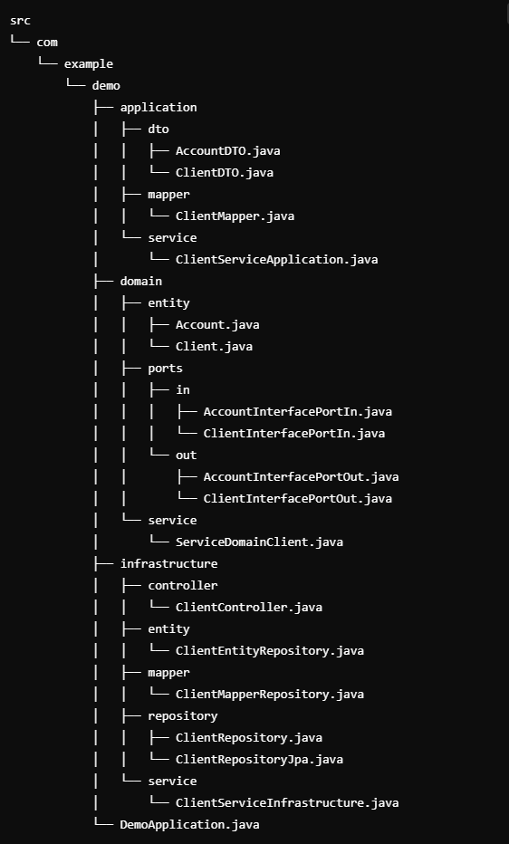

# Hexagonal Architecture Template

This is a simple template for Hexagonal Architecture. It was designed using Java and Spring Boot, with MySQL as the database.

## Project Structure

The project follows the principles of Hexagonal Architecture, which separates the domain logic from the infrastructure and external dependencies. The key components are:

- **Application Layer**: This layer handles communication between the external world and the domain logic. It includes DTOs (Data Transfer Objects), mappers, and application services.
  
- **Domain Layer**: The core business logic of the application. This layer includes entities, service interfaces (ports), and implementation of domain services.

- **Infrastructure Layer**: This layer contains the implementation of the repositories, controllers, and external services, which interact with the domain layer through the defined interfaces (ports).

## Project Structure Overview




## Technologies Used

- **Java** (JDK 17+)
- **Spring Boot** (for REST APIs)
- **MySQL** (for database management)
- **Hibernate / JPA** (for ORM)
- **Gradle** (for build automation)

## Setup

1. Clone this repository:
    ```bash
    git clone https://github.com/your-repo/hexagonal-architecture-template.git
    ```

2. Set up MySQL and configure your database:
    - Create a database and update the `application.properties` file with your MySQL credentials.

3. Run the application:
    - Use the following command to start the Spring Boot application:
    ```bash
    ./gradlew bootRun
    ```

## Endpoints

You can interact with the application through REST API endpoints defined in the controllers.

## Notes

This template follows the Hexagonal Architecture principles and includes basic setups for:
- Application services
- Domain services
- Infrastructure layer
- Simple repository pattern with JPA/Hibernate

Feel free to modify and extend this template to fit your project requirements.
